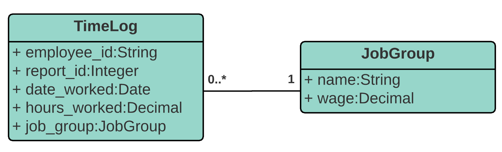

# Wave Software Development Challenge: Payroll System API

### By: Maddie Gabriel B-) :ocean:

## Technologies Used
**API: Python & Django REST Framework**
  - I've never used Django before, so I decided to try something new!
  - I think Django was a good choice for a simple application like this since a lot of things are provided out of the box, like testing and a database. This allowed me to build my app pretty quickly, even if I'm a Django newbie.

**Front end: Bootstrap & JQuery**
- My front end is a very simple single HTML page with an upload button and a responsive Bootstrap table displaying the `payrollReport` object.
- I didn't spend too much time on this, since the focus of the assingment is the API!

### Instructions to Run (macOS)

1. `git clone maddie_gabriel.bundle && cd maddie_gabriel && cd payroll`
2. Set up a virtual environment for Django:
    - `sudo pip3 install virtualenv`
    - `virtualenv my_django_env`
    - `source my_django_env/bin/activate`
2. Install some things:
    - `pip install django django-cors-headers djangorestframework`
3. To migrate database:
    - `python3 manage.py makemigrations`
    - `python3 manage.py migrate`
5. Run development server on port 8000:
    - `python3 manage.py runserver 8000`
6. Test it out! View the app at [http://localhost:8000/](http://localhost:8000/)
4. Optional: To use my Django admin site, create an admin superuser:
    - `python3 manage.py createsuperuser`
    - Then login to admin site at [http://localhost:8000/admin/](http://localhost:8000/admin/)
7. Bonus: you can run my unit tests using: `python3 manage.py test`

### My Design (Models & Data Types)
My application has two models (`TimeLog` and `JobGroup`) with a many-to-one relationship.

### API Endpoints

`POST /upload`
- Uploads and parses CSV file, adding the new time logs into my database.
- Returns 422 (Unprocessable Entity) response if this report was already uploaded
- Returns 200 (OK) on success

`GET /report`
- Returns a JSON object, `payrollReport`, summarizing all the payroll info in the database for all of time - as defined in the spec!

### Design Decisions
- I built a separate model for `JobGroup` because I think it might be useful to add more job groups to the system in the future; for example, if a new employee makes $35 instead of $30. Having a model makes it easy to add this functionality without changing much code. Or, let's say all Job Group A employees got a raise from $20 to $25 dollars - with my design, I only need to change a single entry in the database to handle this. 
- Having a `JobGroup` model also allows me to calculate the earnings for each `TimeLog` within my query by simply accessing the `JobGroup` object's `wage` field.
- I stored the `date_worked` as a `Date` object instead of a `String` so I can handle and store dates in different formats from the CSV, as well as manipulate the date in my SQL query.
- I added some limitations to models' fields, based on what makes sense in the real world. For example, `wage` and `hours_worked` must be greater than 0.
- I created a separate view function for each endpoint in my API. I use a URL mapper to redirect HTTP requests to the appropriate view based on the request URL.
- I decided to use Django because I found the MVT architecture suits this assignment well and allows my API to be more scalable & maintainable.

### Application Questions
**1. How did you test that your implementation was correct?**
- You can see my tests under `/payroll/report/tests`
- Run my tests like so: `python3 manage.py test`
- In `test_models.py`, I wrote some simple unit tests to test the different fields and methods in both my models.
- In `test_views.py`, I wrote a small set of unit tests to validate that my GET request returns the expected `payRoll` JSON object. I started from the example given in the assignment then exercised some different cases. I tested some edge cases related to pay period dates (entries at the start, middle and end of a month, for example).
- Given more time, I would write a lot more unit tests for better test coverage! I would also figure out how to test my `/upload` endpoint.

**2. If this application was destined for a production environment, what would you add or change?**
- *Testing:* I would expand on the unit tests I wrote. I would also write end-to-end/integration tests to test my API endpoints.
- *Validation:* My API is missing a lot of validation, especially when inserting a new TimeLog into the database. I would create more robust error handling before considering using this in production.
- *Database:* I used SQLite for my database, which stores data in a file. SQLite is a lightweight database but can’t support a high level of concurrency. So, I would probably use a different database in production.
- *Scale:* I would need to scale my application to handle increased traffic and probably use a load balancer.
- *Monitoring:* I would implement some kind of monitoring system to alert me if my application goes down and provide analytics on how often users are running into errors.
- *Security:* I'm sure my app isn't production-ready in terms of security. I know Django offers some ways to protect against Cross site scripting and CSRF. I would make sure to set DEBUG to False in `settings.py`, since the debug information that is useful for me is also useful for attackers!

**3. What compromises did you have to make as a result of the time constraints of this challenge?**
- Since this was my first time using Django, I'm sure I didn't follow all the best practices. Given more time I would do more research, especially into serialization (which I didn't quite get working for my TimeLog model, but I know if an important part of working with Django!)
- The front end of my app is very simple, and I didn't spend much time on it at all. I would have liked to make a nice React app, and add some extra features to the interface like table searching and pagination!

### :v: Thanks for reading :v:
I had a lot of fun building this!
